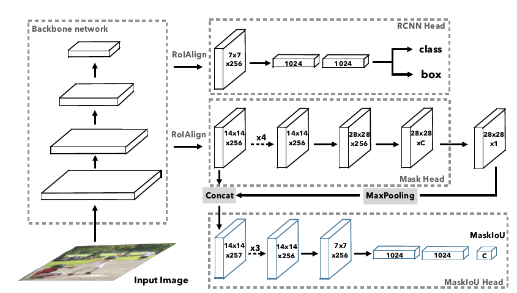
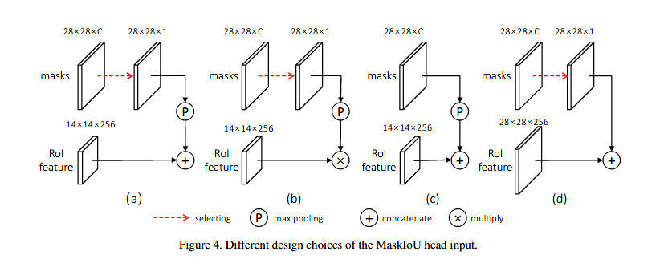

# Begin Again

You are still the young boy wanting to change the world. Don't lost him.

# Basic Concepts

## Kernel Initializer

### 

# Image Segmentation

NIPS2016_Semantic_Segmentation_using_Adversarial_Networks.pdf

## GAN Segmentation

### [NIPS2016] Semantic Segmentation using Adversarial Networks

\[[pdf](./papers/NIPS2016_Semantic_Segmentation_using_Adversarial_Networks.pdf)] \[[web](https://arxiv.org/pdf/1611.08408.pdf)] 

## Instance Segmentation

### [CVPR2019] Mask Scoring R-CNN

\[[pdf](./papers/CVPR2019_MASK_Scoring_R-CNN.pdf)] \[[web](https://arxiv.org/pdf/1903.00241.pdf)] \[[code](https://github.com/zjhuang22/maskscoring_rcnn)]

文中主要改进了一个评分方式。之前的采用的置信度是分类的置信度，这个不太能作为分割结果的评价

文中讨论了不同的MaskIou头的影响，采用消融实验（Ablation study）说明为什么采用这个结构，也可以凑字数

# Video Tasks

## Object Tracking

### [ECCV2016] Fully-Convolutional Siamese Networks for Object Tracking

\[[pdf](./papers/ECCV2016_Fully-Convolutional_Siamese_Networks.pdf)] \[[web](https://arxiv.org/pdf/1606.09549.pdf)] \[[code]()]

解决了对任意物体追踪的任务，之前的算法都是在online对视频的第一帧训练，这也限制了模型的效果。

**如何**

将第一帧的物体作为模板，然后依次和后面的帧匹配

### [CVPR2019] Fast Online Object Tracking and Segmentation: A Unifying Approach

\[[pdf](./papers/CVPR2019_Fast_Online_Object_Tracking_and_Segmentation_A_Unifying_Approach.pdf)] \[[web](https://arxiv.org/pdf/1812.05050.pdf)] \[[code](https://github.com/foolwood/SiamMask)]

